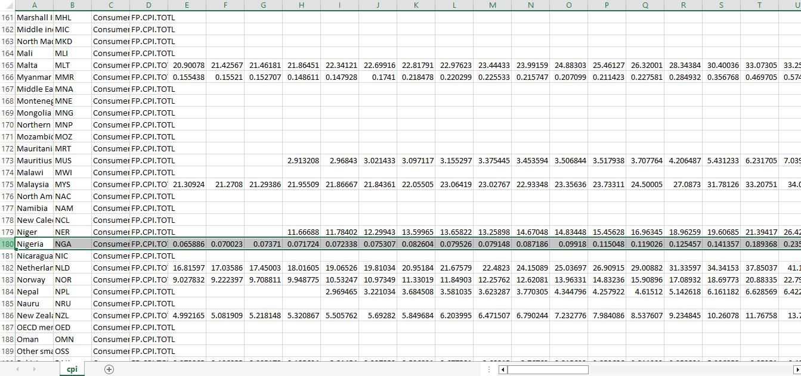
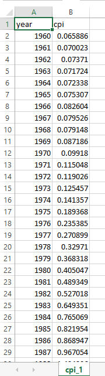

# grain-price-climate-modeling
A data engineering and analytics project leveraging SQL, Excel, and Python to model the relationship between climate anomalies and grain price fluctuations in Nigeria
## 🛠️ Data Engineering & ETL Pipeline

To prepare our four distinct datasets (Food Prices, NDVI, Rainfall, and CPI) for analytical modeling, a structured multi-stage ETL pipeline was executed across Excel and PostgreSQL.

### 📈 Phase 1: Excel Data Cleaning 
Raw climate and market data contained redundant metadata, structural mismatches, and multi-market duplicates. Excel was utilized to isolate Kano and Kaduna states, standardize pricing metrics, and establish clean monthly time-series baselines.
<details>
<summary>🔍 Click to view Before/After: <b>Food Prices Dataset</b></summary>

#### **Data Cleaning Steps Executed**
To prepare the raw market data, I used Excel to clean, filter, and organize the records using these 7 steps:

#### **Before: Granular Multi-Market Mismatch**


#### **After: Standardized Monthly Baseline**


1. **Removed Unnecessary Columns:** Deleted columns that were not needed for the analysis to keep the file clean.
2. **Filtered by Location:** Filtered the data to focus only on **Kano** and **Kaduna** states.
3. **Isolated Commodity & Split Units:** Filtered for **White Maize** and separated the text and numbers in the unit column (e.g., turning "100kg" into `100` and `kg`) using this formula:
   ```excel
   =IF(L2="KG", 1, VALUE(SUBSTITUTE(L2, "KG", "")))
Filtered out Retail: Removed Retail records to focus only on Wholesale data (doing this before splitting the units would have made things more straightforward!).

Split the Date: Separated the full date column to keep only the Month and Year.

Calculated Price Per KG: Created a new column by dividing the total price by the parsed numerical unit.

Aggregated with a Pivot Table: Used a Pivot Table to average and unify the prices where different markets recorded different prices for the same state in the exact same month.

</details>

<details>
<summary>🛰️ Click to view Before/After: <b>NDVI (Vegetation Index) Dataset</b></summary>

#### **Before: Raw Satellite Readings**


#### **After: Clean Monthly VIM Matrix**

</details>

<details>
<summary>🌧️ Click to view Before/After: <b>Rainfall Dataset</b></summary>

#### **Before: Historical Daily Records**


#### **After: Monthly Precipitation Baselines**

</details>

<details>
<summary>📈 Click to view Before/After: <b>CPI (Inflation Index) Dataset</b></summary>

#### **Before: Raw Annual Macro Index**


#### **After: Clean Scaled Inflation Mappings**

</details>
