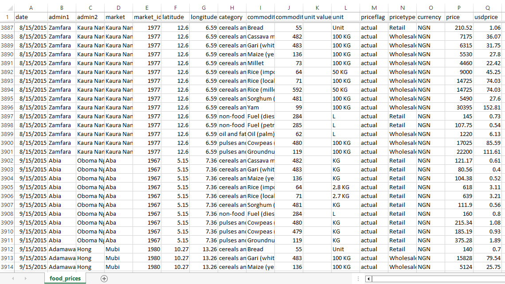
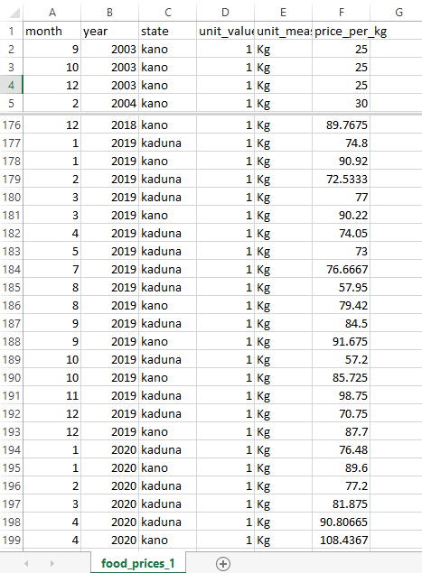
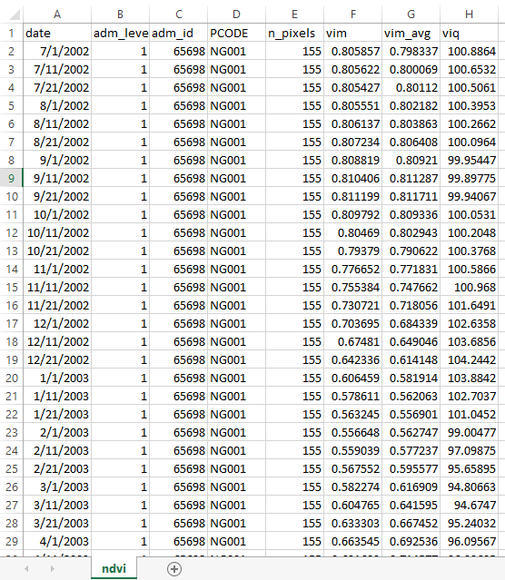
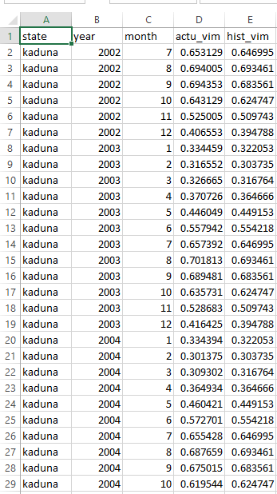
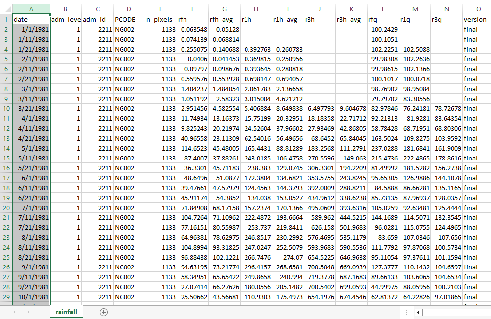
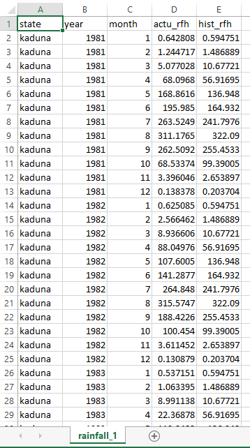

# HEATFLATION

A data engineering and analytics project leveraging SQL, Excel, and Python to model the relationship between climate anomalies and grain price fluctuations in Nigeria


## Heatflation Project Work flow

The project was carried out in six distinct phases.
<br>


- [ ] **Phase 1: Overview/ Clarifying the Problem**
<details>
<summary><kbd> view phase 1 </kbd></summary>
</details>
<br>


      
- [ ] **Phase 2: Data Collection**
<details>
<summary><kbd> view phase 2 </kbd></summary>
</details>   
<br>


      
- [ ] **Phase 3: Data Cleaning** (Excel)
      
<details>
<summary><kbd> view phase 3 </kbd></summary>

   
### Phase 1: Excel Data Cleaning 
Raw climate and market data contained redundant metadata, structural mismatches, and multi-market duplicates. Excel was utilized to isolate Kano and Kaduna states, standardize pricing metrics, and establish clean monthly time-series baselines.

**[View Complete Workbook Raw and Cleaned](https://drive.google.com/drive/folders/1rbZ0VQx3O_sKAHD_Nkm7Jmk7rwf6XcDj?usp=drive_link)**

<details>
<summary> Click to view Before/After: <b>Food Prices Dataset</b></summary>

#### **Before: Granular Multi-Market Mismatch**


#### **After: Standardized Monthly Baseline**


#### **Data Cleaning Steps Executed**
To prepare the raw market data, I used Excel to clean, filter, and organize the records using these 7 steps:

1. **Removed Unnecessary Columns:** Deleted columns that were not needed for the analysis to keep the file clean.
2. **Filtered by Location:** Filtered the data to focus only on **Kano** and **Kaduna** states.
3. **Isolated Commodity & Split Units:** Filtered for **White Maize** and separated the text and numbers in the unit column (e.g., turning "100kg" into `100` and `kg`) using this formula:
   ```excel
   =IF(L2="KG", 1, VALUE(SUBSTITUTE(L2, "KG", "")))
4. **Filtered out Retail:** Removed Retail records to focus only on Wholesale data (doing this before splitting the units would have made things more straightforward!).
5. **Split the Date:** Separated the full date column to keep only the Month and Year.
6. **Calculated Price Per KG:** Created a new column by dividing the total price by the parsed numerical unit.
7. **Aggregated with a Pivot Table:** Used a Pivot Table to average and unify the prices where different markets recorded different prices for the same state in the exact same month.

</details>

<details>
<summary> Click to view Before/After: <b>NDVI (Vegetation Index) Dataset</b></summary>

#### **Before: Raw Satellite Readings**


#### **After: Clean Monthly VIM Matrix**

</details>

<details>
<summary> Click to view Before/After: <b>Rainfall Dataset</b></summary>

#### **Before: Historical Daily Records**


#### **After: Monthly Precipitation Baselines**

</details>

<details>
<summary> Click to view Before/After: <b>CPI (Inflation Index) Dataset</b></summary>


#### **Before: Raw Annual Macro Index**


#### **After: Clean Scaled Inflation Mappings**

</details>
</details>
<br>


- [ ] **Phase 4: Data Analysis** (SQL)
<details>
<summary><kbd> view phase 4 </kbd></summary>


**Database Architecture:** [Master SQL Script](./sql.sql)
</details>
<br>


- [ ] **Phase 5: Pattern Recognition** (Python)
<details>
<summary><kbd> view phase 5 </kbd></summary>
</details>
<br>


 
- [ ] **Phase 6: Data Visualization and Storytelling**
<details>
<summary><kbd> view phase 6 </kbd></summary>

      
